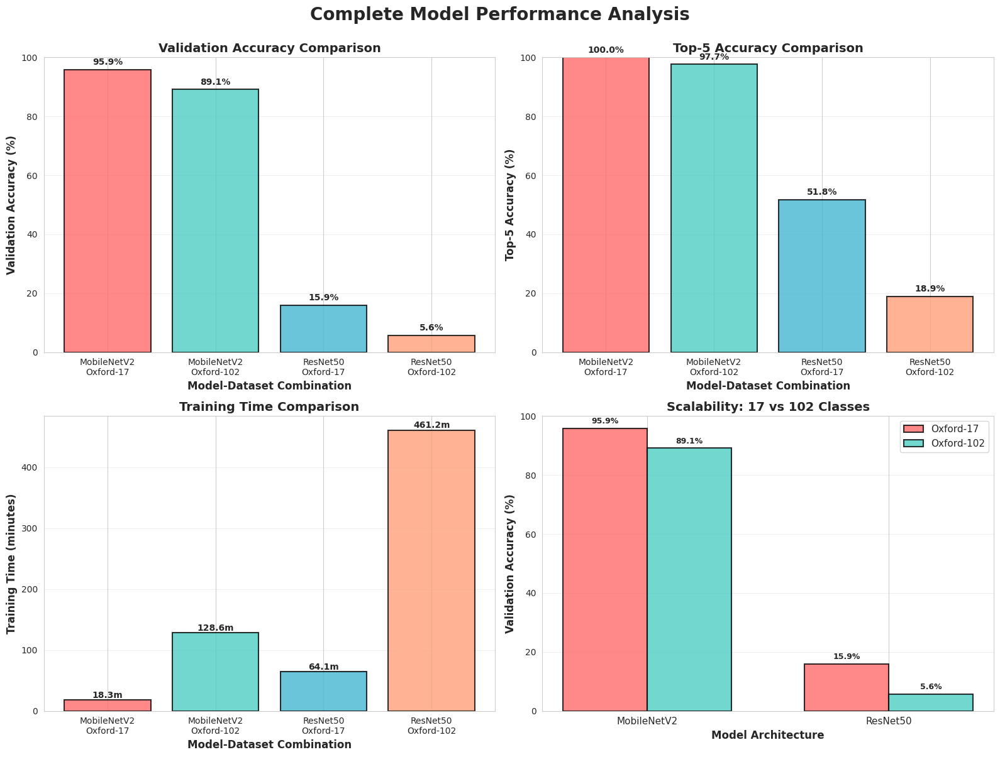
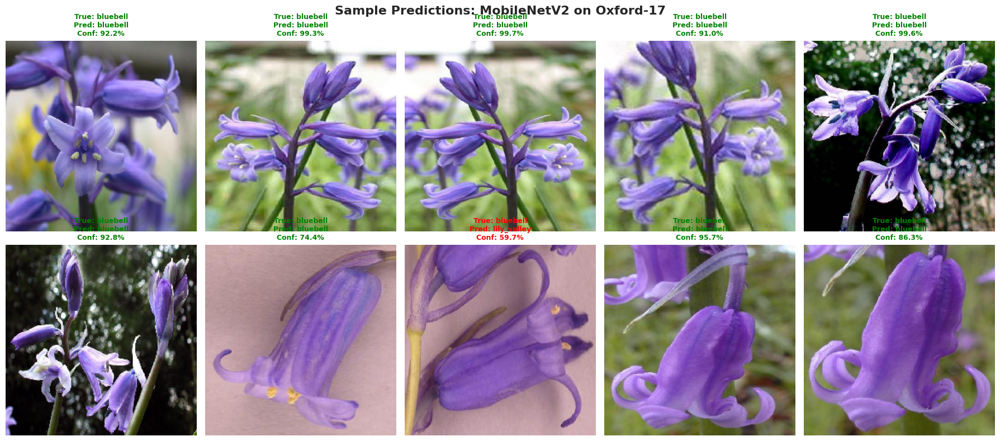

# Scalability Analysis of Deep Learning Models for Flower Classification

## Overview

Comparison of **MobileNetV2** and **ResNet50** architectures on two flower datasets, one with 17 classes and another with 102 classes with the intention of analyzing model scalability and performance to use in real-world plant identification tasks.

We learned how deep learning scale (or don't, in some cases) when applying them on the range of 17 and 102 categories.

---

## Datasets

### Oxford-17 Flowers
- **Classes:** 17 flower species
- **Images:** 1,360 (80 per class)
- **Source:** [Kaggle](https://www.kaggle.com/datasets/sanikamal/17-category-flower-dataset)

### Oxford-102 Flowers
- **Classes:** 102 flower species
- **Images:** 8,189 (40-258 per class)
- **Source:** [Kaggle](https://www.kaggle.com/datasets/nunenuh/pytorch-challange-flower-dataset)

**Preprocessing:**
- Image size: 224×224
- Augmentation: rotation, shift, zoom, flip
- Normalization: [0, 1]

---

## Model Architectures

### MobileNetV2
- **Base:** ImageNet pre-trained, frozen
- **Head:** GAP → Dense(512) → Dropout(0.5) → Softmax
- **Parameters:** ~2.3-3.5M
- **Best for:** Mobile apps, edge devices, fast inference

### ResNet50
- **Base:** ImageNet pre-trained, frozen
- **Head:** GAP → Dense(1024) → Dropout(0.5) → Dense(512) → Dropout(0.3) → Softmax
- **Parameters:** ~24-25M
- **Best for:** Server deployment, maximum accuracy

---

## Training Configuration

- **Optimizer:** Adam (lr=0.001)
- **Loss:** Categorical Cross-Entropy
- **Batch Size:** 32
- **Epochs:** 15-20 with early stopping
- **Callbacks:** Early stopping (patience=5), ReduceLR (factor=0.5, patience=3)
- **Hardware:** Google Colab GPU

---

## Results

### Performance Summary

| Model | Dataset | Classes | Val Accuracy | Top-5 Accuracy | Training Time |
|-------|---------|---------|--------------|----------------|---------------|
| MobileNetV2 | Oxford-17 | 17 | **95.88%** | **100.00%** | 18.26 mins |
| MobileNetV2 | Oxford-102 | 102 | **89.12%** | **97.68%** | 128.61 mins |
| ResNet50 | Oxford-17 | 17 | 15.88% | 51.76% | 64.09 mins |
| ResNet50 | Oxford-102 | 102 | 5.62% | 18.95% | 461.17 mins |

### Findings

1. **Scalability:** MobileNetV2 had only **6.76%** accuracy drop (95.88% → 89.12%), which means it is scalable

2. **Best Model:** **MobileNetV2 significantly outperformed ResNet50** in all metrics:
   - Oxford-17: 95.88% vs 15.88% (80% higher)
   - Oxford-102: 89.12% vs 5.62% (83.5% higher)

3. **Efficiency:** MobileNetV2 trains **3.5x faster** on Oxford-17 and **3.6x faster** on Oxford-102

4. **Worst Model:** ResNet50 severely underperformed, for reasons such as:
   - Insufficient unfreezing of layers for fine-tuning
   - Small dataset size not suitable for deeper architecture
   - Overfitting despite dropout
   - Need for different training strategy (lower learning rate, longer training)

---

## Visualizations

### Model Comparison


### Sample Predictions


---

## How to Run

### Setup
```bash
# Install dependencies
pip install tensorflow keras scikit-learn matplotlib seaborn pillow

# Configure Kaggle API
mkdir -p ~/.kaggle
cp kaggle.json ~/.kaggle/
chmod 600 ~/.kaggle/kaggle.json
```

### Download Datasets
```bash
kaggle datasets download -d sanikamal/17-category-flower-dataset
kaggle datasets download -d nunenuh/pytorch-challange-flower-dataset
```

### Run Training
Execute all cells in `ML_Project.ipynb` sequentially.

---

## Real-World Applications

- **Agricultural Automation:** Crop/weed identification ($15B+ market)
- **Conservation:** Endangered species monitoring
- **Pharmaceutical:** Medicinal plant identification

---

## Future Work

- Fine-tune ResNet50 with unfrozen top layers and lower learning rate
- Try out EfficientNet and Vision Transformers
- Implement ensemble methods, potentially combining both architectures

---
